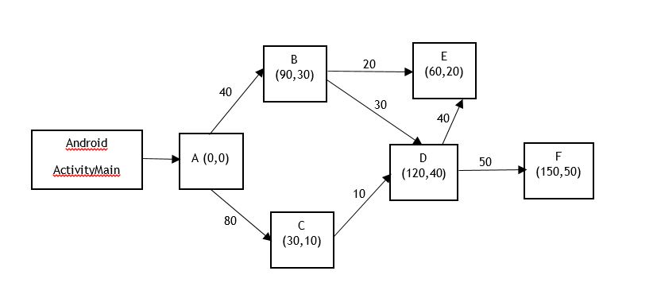

# code-offload
mobile cloud computing- SOFTMOD Project

Figure 1: Method call graph

This method call graph was created by the SOFTMoD code offloading framework. 
Each object was created by the framework and desired method is called as below:

OffloadingFactory offManager = OffloadingFactory.getInstance();
ConstructorParam cp = new ConstructorParam();
cp.setConstructorArgTypes(Byte.class);
cp.setConstructorArgValues(new byte[600*800]);

B b = offManager.create(B.class,offManager.getApplicationContext(),cp);
C c = offManager.create(C.class,offManager.getApplicationContext(),null);

b.doB(new byte[40]);
c.doC(new byte[80]);

The framework started to profile each object and its methods to create method call graph in Figure 1.

Then this method call graph was converted to the cost graph in order to apply partitioning algorithm to find best partition for productive code offloading.
---

in app/src/main/java/readmire/offloadingframework/  
there is a offloading framework class creating call graph in Figure 1.
This call graph is created and solved automatically.

in app/src/main/java/readmire/TestGraphCut   
there is a GraphCut class, you can create graphs manually and solve it by providing algorithms.

in app/src/main/java/readmire/TestRandomGraph 
there is a RandomGraphGenerator, you can create a random graph having desired number of tasks and then solve it by partitioning algorithms.

